# Lechuga Vision — Detección de Enfermedades en Lechuga con YOLO11n

Proyecto de visión por computadora para **detectar y clasificar enfermedades en cultivos de lechuga** usando **Ultralytics YOLO11n** en modo detección (`detect`).

Se entrenaron dos modelos (90 y 150 épocas) sobre un dataset de Roboflow con 7 clases. Se obtuvieron **buenos resultados generales en precisión y mAP**, pero con un **recall bajo (~0.60)**, lo que provoca que el modelo no logre identificar correctamente todas las clases (muchos falsos negativos y confusión entre enfermedades visualmente similares).

## 1. Clases detectadas

| ID | Clase | Descripción |
|----|-------|-------------|
| 0 | `Bacterial` | Manchas bacterianas |
| 1 | `Downy_mildew` | Mildiu velloso |
| 2 | `Lettuce - Anthracnose` | Antracnosis |
| 3 | `Powdery_mildew` | Mildiu polvoroso / Oídio |
| 4 | `Septoria_Blight` | Tizón por Septoria |
| 5 | `healthy` | Lechuga sana |
| 6 | `lettuce mosaic virus` | Virus del mosaico de la lechuga |

## 2. Dataset

- Fuente: [Roboflow Universe — disease lettuce](https://universe.roboflow.com/hugo-david-nogueda-hernandez/disease-lettuce-h69zb-384qi/dataset/1)
- Formato: YOLOv8/YOLO11 (`images/` + `labels/` con `class x_center y_center w h` normalizados).
- Licencia del dataset: **CC BY 4.0**.
- Configuración: `dataset/data.yaml`

Distribución:

| Split | Imágenes | Etiquetas | Uso |
|-------|-----------|-----------|-----|
| `train` | 6948 | 6948 | Entrenamiento |
| `valid` | 434 | 434 | Validación |
| `test` | 435 | 435 | Prueba |
| **Total** | **7817** | **7817** | — |

> Nota: parte de las anotaciones originales venían en formato segmentación (polígonos `cls x1 y1 x2 y2 ...`). Se normalizaron a cajas de detección con `scripts/convertir_dataset.py`.

## 3. Estructura del proyecto

```text
Entrenamiento_lechugas/
├── dataset/                  # Dataset en formato YOLO (train/valid/test + data.yaml)
├── dataset_backup/           # Respaldo del dataset original
├── images/                   # Imágenes de ejemplo para pruebas
├── runs/
│   ├── detect/
│   │   ├── lechuga_yolo11n_90ep/   # Entrenamiento 90 épocas (pesos, curvas, matrices)
│   │   └── lechuga_yolo11n_150ep/  # Entrenamiento 150 épocas (modelo final)
│   └── test_01/              # Otra corrida / prueba de evaluación
├── scripts/
│   ├── analizar_dataset.py   # Conteo de cajas por clase y detección de anotaciones inválidas
│   ├── convertir_dataset.py  # Convierte máscaras/segmentación a bbox YOLO (xmin/xmax → x_center, w, h)
│   ├── camara.py             # Prueba simple de webcam con OpenCV
│   ├── prueba.py             # Detección en tiempo real con el modelo entrenado (best.pt)
│   └── prueba_foto.py        # Inferencia sobre una imagen fija
├── yolo11n.pt                # Pesos base pre-entrenados
└── venv/                     # Entorno virtual Python
```

## 4. Requisitos e instalación

- Python 3.12 / 3.13
- GPU NVIDIA recomendada (`device=0`). También funciona en CPU.

```bash
python -m venv venv
source venv/bin/activate
pip install ultralytics==8.4.153 opencv-python torch torchvision numpy
```

Versiones verificadas en este proyecto:

| Paquete | Versión |
|---------|---------|
| `ultralytics` | 8.4.153 |
| `torch` | 2.14.0 |
| `torchvision` | 0.29.0 |
| `opencv-python` | 5.0.0.93 |
| `numpy` | 2.5.3 |

## 5. Uso

### 5.1 Analizar el dataset

Verifica distribución de clases, archivos vacíos y anotaciones inválidas:

```bash
python scripts/analizar_dataset.py
```

### 5.2 Convertir segmentación → detección

Si el dataset trae polígonos en lugar de cajas YOLO:

```bash
python scripts/convertir_dataset.py
```

Convierte cada polígono a su bounding-box envolvente:

```text
x_center = (x_min + x_max) / 2
y_center = (y_min + y_max) / 2
width    = x_max - x_min
height   = y_max - y_min
```

### 5.3 Probar la cámara

```bash
python scripts/camara.py
```

### 5.4 Inferencia en tiempo real (webcam + modelo entrenado)

```bash
python scripts/prueba.py
```

Usa `runs/detect/lechuga_yolo11n_150ep/weights/best.pt` y muestra las detecciones con `results[0].plot()`. Presiona `q` para salir.

### 5.5 Inferencia en una foto

Edita la ruta de la imagen en `scripts/prueba_foto.py` y ejecuta:

```bash
python scripts/prueba_foto.py
```

### 5.6 Re-entrenar

```bash
yolo detect train \
  model=yolo11n.pt \
  data=dataset/data.yaml \
  epochs=150 \
  imgsz=640 \
  batch=16 \
  device=0 \
  name=lechuga_yolo11n_150ep
```

Hiperparámetros principales usados: `imgsz=640`, `batch=16`, `optimizer=auto`, `lr0=0.01`, `patience=100`, `pretrained=True`, `seed=0`.

## 6. Resultados

Se entrenó **YOLO11n** desde `yolo11n.pt` con el mismo dataset y dos duraciones.

### 6.1 Modelo 90 épocas (`lechuga_yolo11n_90ep`)

| Métrica (validación) | Última época (90) | Mejor época (66 por mAP) |
|----------------------|--------------------|--------------------------|
| Precision (Box) | 0.742 | 0.741 |
| **Recall (Box)** | **0.576** | **0.617** |
| mAP50 | 0.626 | 0.646 |
| mAP50-95 | 0.449 | 0.458 |

### 6.2 Modelo 150 épocas (`lechuga_yolo11n_150ep`) — modelo final

| Métrica (validación) | Última época (150) | Mejor época (149 por mAP) |
|----------------------|---------------------|---------------------------|
| Precision (Box) | 0.838 | 0.841 |
| **Recall (Box)** | **0.597** | **0.596** |
| mAP50 | 0.660 | 0.660 |
| mAP50-95 | 0.476 | 0.477 |

#### Curvas de entrenamiento (150 épocas)

Curva de Precisión vs Confianza:

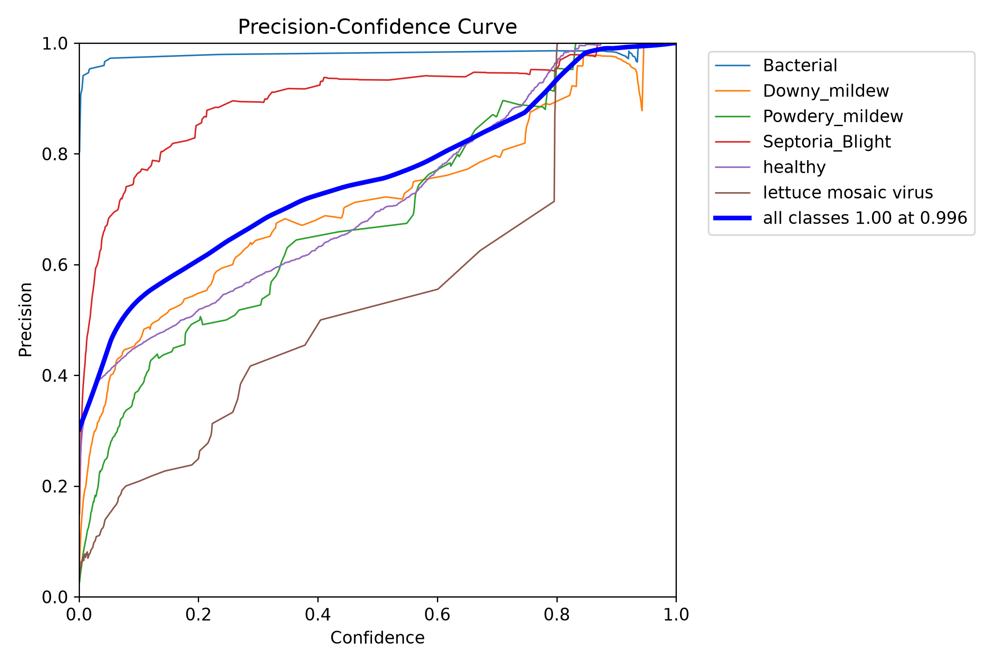

Curva de Recall vs Confianza — aquí se observa el problema: el recall cae rápidamente al aumentar la confianza, se estanca en ~0.60:

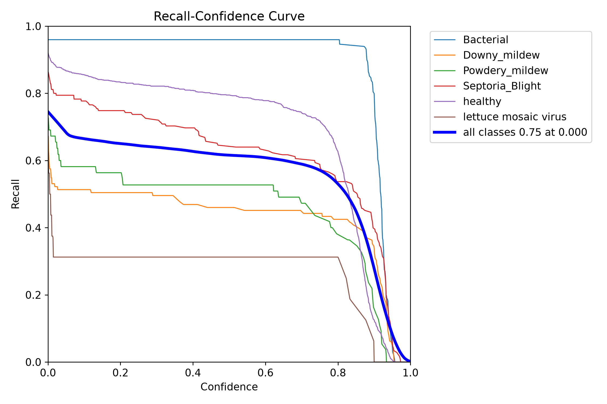

Curva Precision-Recall:

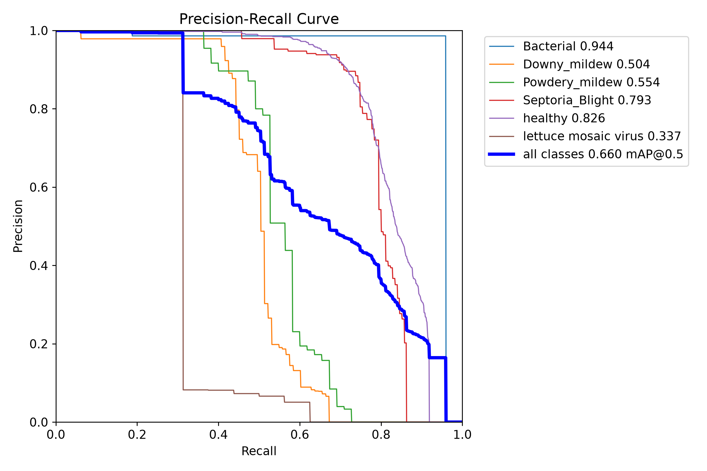

Curva F1-Confianza:

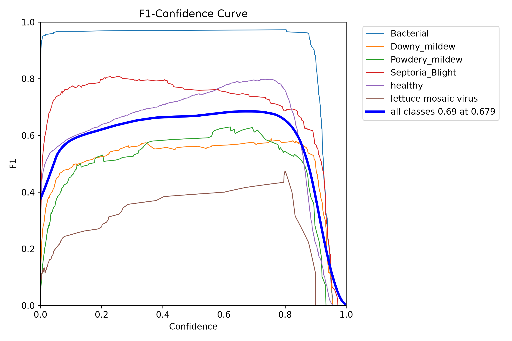

#### Matrices de confusión (150 épocas)

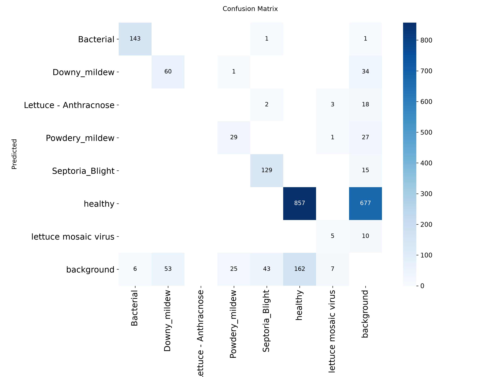

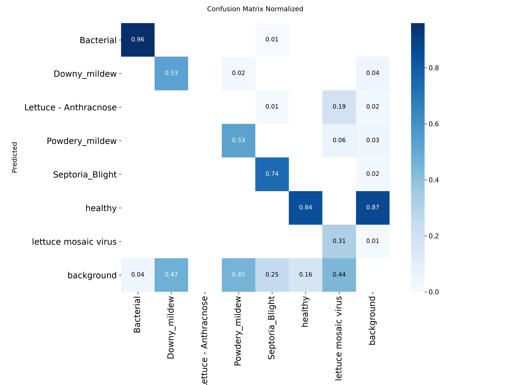

#### Curvas de entrenamiento (90 épocas, referencia)

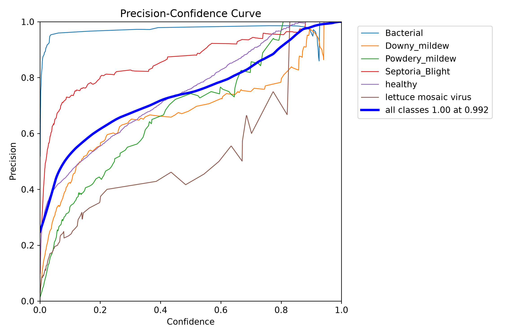

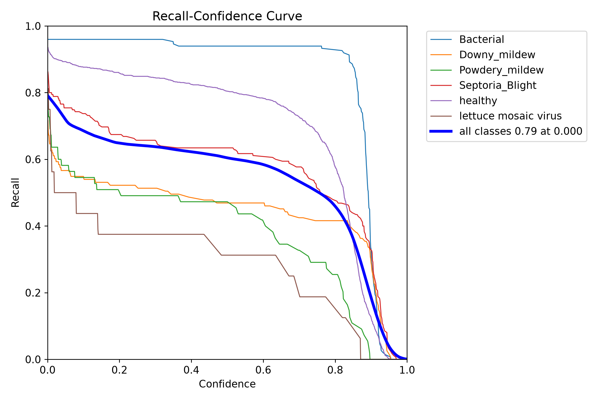

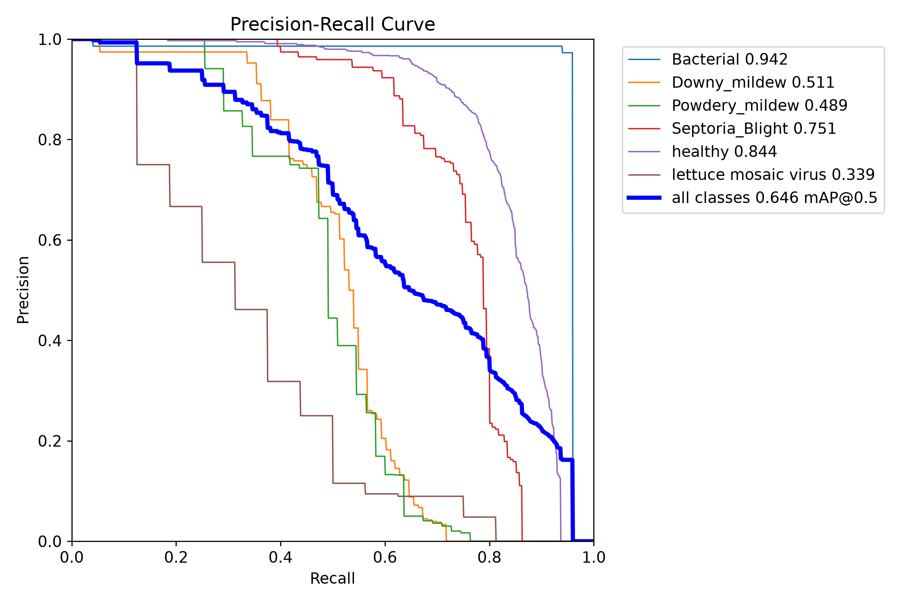

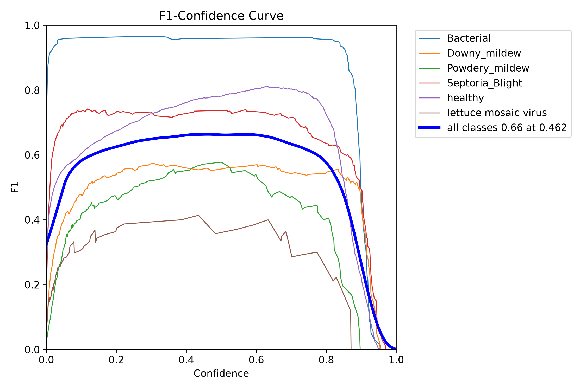

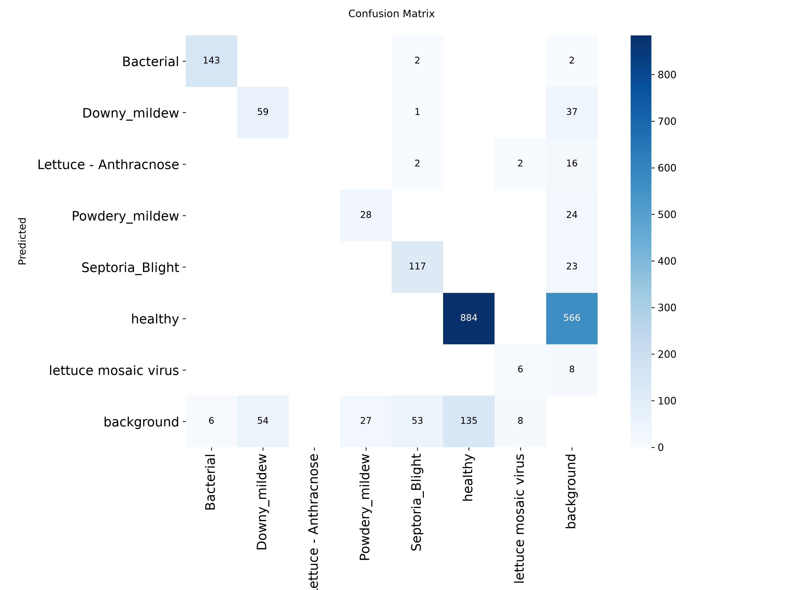

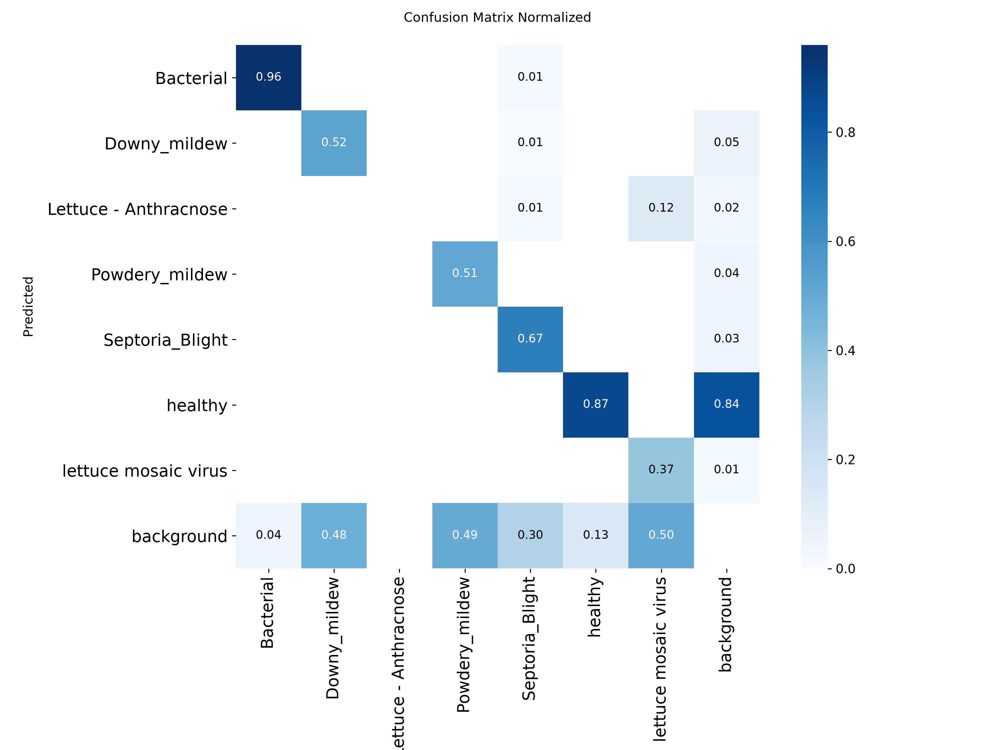

Gráficas y evidencias generadas por Ultralytics en cada carpeta de `runs/`:

- `results.png`, `results.csv`
- `confusion_matrix.png`, `confusion_matrix_normalized.png`
- `BoxP_curve.png`, `BoxR_curve.png`, `BoxPR_curve.png`, `BoxF1_curve.png`
- `val_batch*_labels.jpg` vs `val_batch*_pred.jpg`

### 6.3 Lectura de los resultados

- **Buenos resultados:** la precisión es alta (hasta ~0.84 a 150 épocas) y el mAP50 (~0.66) y mAP50-95 (~0.48) son competitivos para un modelo nano con 7 clases de enfermedades foliares. Cuando el modelo predice, suele acertar.
- **Problema — recall muy bajo:** el recall se estanca en **~0.57–0.62 (90 ep)** y **~0.60 (150 ep)**. Esto significa una **tasa alta de falsos negativos**: muchas lechugas enfermas no son detectadas o son clasificadas como fondo/otra clase.
- **Consecuencia:** no se logran identificar correctamente todas las clases, sobre todo las minoritarias o visualmente similares (p. ej. `Downy_mildew` vs `Powdery_mildew`, `Bacterial` vs `Septoria_Blight`). La matriz de confusión normalizada muestra esta confusión inter-clase y pérdida hacia fondo.
- **Causas probables:** desbalance de clases, síntomas pequeños/sutiles a 640 px, alta similitud visual entre enfermedades, anotaciones ruidosas y el exigir al detector que **localice y clasifique a la vez** 7 clases de grano fino.

## 7. Trabajo futuro propuesto

Para subir el recall y la fiabilidad en campo, se propone un **enfoque en dos etapas**:

1. **Etapa 1 — Detección (una sola clase):** entrenar un detector YOLO (`single_cls`) que solo localice **"lechuga / hoja"**, sin distinguir enfermedad. Detectar un objeto grande y claro es mucho más fácil y eleva el recall de localización.
2. **Etapa 2 — Clasificación (enfermedad):** recortar cada bbox detectado y pasarlo a un **modelo clasificador** dedicado (p. ej. `YOLO11n-cls`, ResNet, EfficientNet o Vision Transformer) entrenado solo para clasificar entre las 7 clases (6 enfermedades + sana).

Ventajas esperadas:

- El detector deja de confundirse entre enfermedades parecidas.
- El clasificador trabaja sobre recortes centrados, pudiendo usar mayor resolución y aumentaciones específicas (color, textura, CutMix/MixUp).
- Permite balancear clases, usar pesos focales y métricas por clase de forma independiente.
- Pipeline final: `detectar lechuga → crop → clasificar enfermedad → mostrar etiqueta + confianza`.

Pasos sugeridos:

- [ ] Generar dataset `detect` de 1 clase (`lettuce`) a partir de las cajas actuales.
- [ ] Generar dataset `classify` con recortes por bbox etiquetados por enfermedad.
- [ ] Entrenar `yolo classify train` y comparar Top-1 / Top-5 accuracy, recall por clase y F1.
- [ ] Evaluar el pipeline completo en video de campo y medir recall end-to-end.

## 8. Licencia y créditos

- Código del proyecto: úsese según la licencia que defina el autor.
- Dataset `disease lettuce` de Roboflow Universe: **CC BY 4.0** (ver `dataset/README.dataset.txt`).
- Modelo base: `yolo11n.pt` de [Ultralytics](https://docs.ultralytics.com/).
